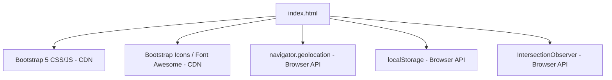

# Design Document

## Overview

SafeHer / SheShield is a client-side-only single-page web application (SPA) built with HTML5, CSS3, Bootstrap 5 (CDN), and vanilla JavaScript. It targets women's safety by providing emergency SOS functionality, safety tools, a blog, and a community feed — all without any backend or network requests beyond CDN asset loading.

The application is delivered as a single HTML file with embedded `<style>` and `<script>` blocks. All state is ephemeral (in-memory) except for the optional dark-mode preference, which is persisted to `localStorage`.

### Design Goals

- Zero backend dependency — all interactions are client-side simulations
- Mobile-first responsive layout (320px–1920px)
- Accessible, polished UI using glassmorphism, gradients, and smooth animations
- Color palette: Deep Purple (primary), Teal (secondary), Electric Blue / Orange (accent) — no pink or red

---

## Architecture

The application follows a flat, single-file architecture. There are no modules, build steps, or bundlers. All logic lives in one HTML file.

```
index.html
├── <head>
│   ├── Bootstrap 5 CSS (CDN)
│   ├── Bootstrap Icons / Font Awesome (CDN)
│   └── <style> — custom CSS (variables, animations, glassmorphism, dark mode)
├── <body>
│   ├── Navbar
│   ├── Hero Section
│   ├── SOS Section
│   ├── Safety Tools Section
│   ├── Blog Section
│   ├── Community Section
│   ├── Footer
│   └── <script> — vanilla JS (SOS logic, community feed, dark mode, scroll animations)
```

### Dependency Graph



No runtime dependencies are installed locally. The application degrades gracefully when CDN assets are unavailable (layout may break) and when browser APIs are unsupported (explicit error messages shown).

---

## Components and Interfaces

### 1. Navbar

- Fixed/sticky at top (`position: sticky; top: 0`)
- Brand logo + name (SafeHer / SheShield)
- Links: Home, SOS, Safety Tools, Blog, Community, Contact
- Collapses to hamburger toggle below 992px (Bootstrap `navbar-toggler`)
- Language Selector dropdown (UI-only, updates label on selection)
- Dark Mode toggle button (optional, Requirement 10)
- Glassmorphism styling via `backdrop-filter: blur()`

### 2. Hero Section

- Full-viewport-height section with CSS gradient background
- Headline: "Your Safety, Your Power"
- Subtext paragraph
- CTA button "Activate SOS" — `onclick` scrolls to `#sos` section via `scrollIntoView({ behavior: 'smooth' })`

### 3. SOS Section

- Large centered SOS button with CSS `@keyframes pulse` animation
- On click: invokes `navigator.geolocation.getCurrentPosition()`
  - Success: displays coordinates + "Location sent to emergency contacts" message
  - Error: displays descriptive denial/unavailable message
  - Unsupported: displays "Geolocation not supported" message
- Coordinate display area (hidden until triggered)
- Alert simulation message area

### 4. Safety Tools Section

Three Bootstrap cards:

| Card | Content |
|------|---------|
| Emergency Checklist | Static list of preparedness items |
| Nearby Help | Styled `<div>` map placeholder with label |
| Report Unsafe Area | Form with location description + incident type fields; on submit shows client-side confirmation, no network request |

- Hover effect: CSS `transform: translateY(-4px)` + `box-shadow` transition
- Icons from Bootstrap Icons or Font Awesome CDN

### 5. Blog Section

- Responsive Bootstrap grid (`col-md-4`)
- Minimum 3 blog cards, each with: image/placeholder, title, description, "Read More" button
- Topics: safety tips, awareness, real stories
- Hover transition on cards
- Reflows to single column on mobile

### 6. Community Section

- Textarea + Submit button for new posts
- On submit:
  - Empty input: show validation message, do not add post
  - Valid input: prepend new post card to feed, clear textarea
- Minimum 3 pre-populated sample posts rendered on load

### 7. Footer

- Quick nav links (mirrors Navbar)
- Emergency helplines: Women Helpline 1091, Police 100, Ambulance 102
- Social media icons (Twitter/X, Instagram, Facebook) via icon CDN
- Gradient / glassmorphism styling consistent with overall palette

### 8. UI Enhancements

- `scroll-behavior: smooth` on `<html>` element
- `IntersectionObserver` triggers `.fade-in` CSS class on sections entering viewport
- Hover transitions on all buttons and cards
- Glassmorphism on Navbar and cards (`backdrop-filter`, semi-transparent `background`)
- Gradient backgrounds on Hero and SOS sections

---

## Data Models

Since this is a purely client-side application with no persistence layer (except `localStorage` for theme), the "data models" are in-memory JavaScript objects and DOM state.

### Theme Preference (localStorage)

```js
// Key: 'theme'
// Value: 'dark' | 'light'
localStorage.getItem('theme') // => 'dark' | 'light' | null
```

### Community Post (in-memory)

```js
{
  text: string,      // user-submitted message content (non-empty, trimmed)
  timestamp: string  // display timestamp (e.g., "Just now")
}
```

### Geolocation Result (in-memory, transient)

```js
// Success
{
  status: 'success',
  latitude: number,
  longitude: number
}

// Error
{
  status: 'error',
  message: string  // human-readable description
}

// Unsupported
{
  status: 'unsupported'
}
```

### Language Selector State (in-memory, UI-only)

```js
{
  selectedLanguage: string  // e.g., 'English' | 'Hindi' | 'Spanish'
}
```

No serialization or deserialization of these models occurs — they exist only as transient DOM/JS state during the page session.

---

## Correctness Properties

*A property is a characteristic or behavior that should hold true across all valid executions of a system — essentially, a formal statement about what the system should do. Properties serve as the bridge between human-readable specifications and machine-verifiable correctness guarantees.*

### Property 1: Nav links target existing sections

*For any* navigation link in the Navbar, the `href` anchor value must correspond to an `id` attribute that exists on a section element in the document.

**Validates: Requirements 1.4**

---

### Property 2: Geolocation success displays coordinates and alert message

*For any* successful geolocation response (with latitude and longitude values), the application must display both the coordinate values and the exact message "Location sent to emergency contacts" in the UI.

**Validates: Requirements 4.3, 4.4**

---

### Property 3: Blog cards are complete and sufficient

*For any* blog card rendered in the Blog Section (and there must be at least three), the card must contain an image or styled placeholder, a title, a short description, and a "Read More" button.

**Validates: Requirements 6.1, 6.2**

---

### Property 4: Valid community message appears in feed

*For any* non-empty, non-whitespace message submitted via the Community Section input, the submitted text must appear as a new post in the community feed after submission.

**Validates: Requirements 7.2**

---

### Property 5: Hover transitions applied to all interactive elements

*For any* interactive button or card element in the application, the element must have a CSS `transition` property defined so that hover effects are animated.

**Validates: Requirements 9.3**

---

### Property 6: Dark mode toggle is a round trip

*For any* initial theme state, activating the dark mode toggle and then deactivating it must restore the page to its original color scheme (i.e., the `dark` class is removed from the document root).

**Validates: Requirements 10.3**

---

### Property 7: Theme preference persists across sessions

*For any* theme selected by the user (dark or light), the preference must be written to `localStorage` under the key `'theme'`, and re-initializing the application must read and apply that stored preference.

**Validates: Requirements 10.4**

---

### Property 8: Language selector updates label without altering content

*For any* language option selected from the Language Selector dropdown, the dropdown label must update to reflect the selected language, and no other text content on the page must change as a result of the selection.

**Validates: Requirements 11.2**

---

## Error Handling

| Scenario | Handling |
|----------|---------|
| Geolocation permission denied | Display message: "Location access was denied. Please enable location permissions." |
| Geolocation unavailable (timeout/network) | Display message: "Location is currently unavailable. Please try again." |
| Geolocation API not supported by browser | Display message: "Geolocation is not supported by your browser." |
| Community form submitted with empty/whitespace input | Prevent post creation; display inline validation message: "Please enter a message before posting." |
| Report Unsafe Area form submitted | Prevent default form submission; display client-side confirmation; make no network requests |
| CDN assets fail to load | Application degrades gracefully — layout may be unstyled but core HTML content remains accessible |

All error states are displayed inline within the relevant section (not as modal dialogs or alerts) to maintain a non-disruptive UX.

---

## Testing Strategy

### Dual Testing Approach

Both unit tests and property-based tests are required for comprehensive coverage. They are complementary:

- **Unit tests** verify specific examples, DOM structure, and edge cases
- **Property tests** verify universal behaviors across many generated inputs

### Unit Tests

Unit tests focus on:

- DOM structure verification (sections exist, required elements present, correct text content)
- Specific interaction examples (SOS button click with mocked geolocation, community post submission)
- Edge cases (empty community input, geolocation error/unsupported, form submission without network request)
- Dark mode toggle behavior (class applied/removed, localStorage read/write)
- Language selector label update

Recommended framework: **Jest** with **jsdom** (or equivalent browser-environment test runner such as Vitest with jsdom).

Example unit test areas:
- Navbar contains all 6 required links
- Hero section contains "Your Safety, Your Power" headline
- SOS button has pulse animation CSS class
- Submitting empty community message shows validation, does not add post
- Geolocation error path shows correct error message
- Footer contains 3 emergency helpline numbers

### Property-Based Tests

Recommended library: **fast-check** (JavaScript property-based testing library).

Each property test must run a minimum of **100 iterations**.

Each test must include a comment tag in the format:
`// Feature: women-safety-web-app, Property {N}: {property_text}`

| Property | Test Description |
|----------|-----------------|
| Property 1 | Generate random nav link sets; verify each href maps to an existing section id |
| Property 2 | Generate random lat/lng coordinate pairs; mock geolocation success; verify both values and alert message appear in DOM |
| Property 3 | Verify all rendered blog cards (≥3) each contain all 4 required sub-elements |
| Property 4 | Generate random non-empty strings; submit as community messages; verify each appears in feed |
| Property 5 | Query all buttons and cards; verify each has a CSS transition property defined |
| Property 6 | Generate random initial theme states; toggle dark mode on then off; verify original state restored |
| Property 7 | Generate random theme values ('dark'/'light'); apply theme; verify localStorage key matches; re-init; verify applied theme matches |
| Property 8 | Generate random language option selections; verify label updates to selected value; verify no other DOM text changes |

### Coverage Goals

- All acceptance criteria with testable status (example or property) must have at least one corresponding test
- Edge cases (geolocation error, empty community input, form submission) must each have a dedicated unit test
- Property tests must cover all 8 correctness properties defined above
